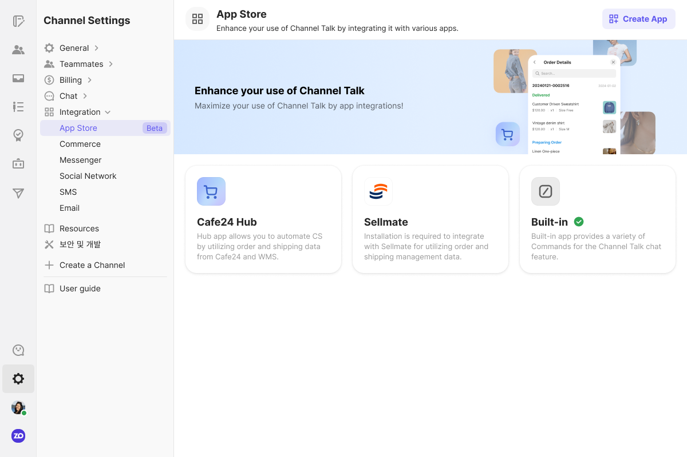
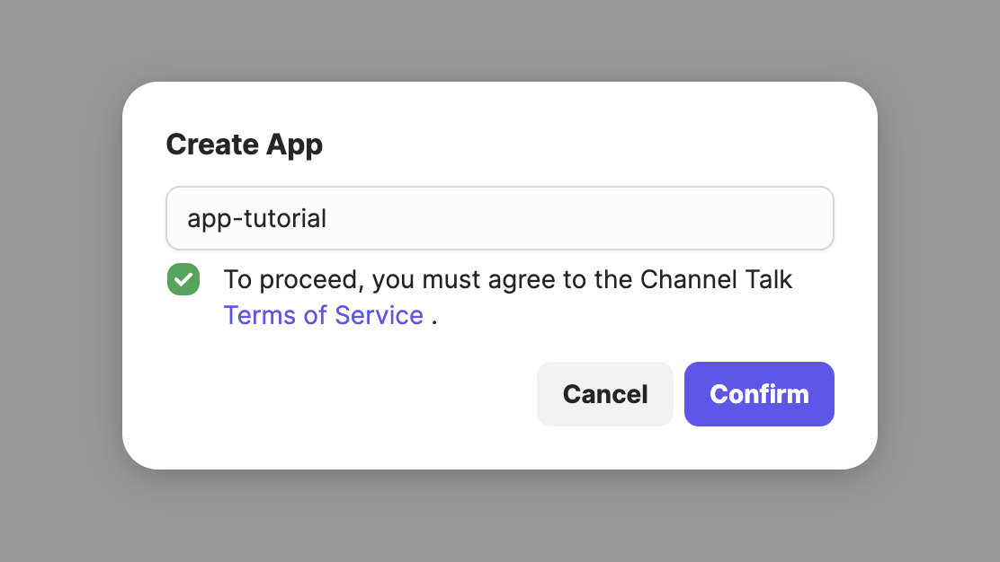
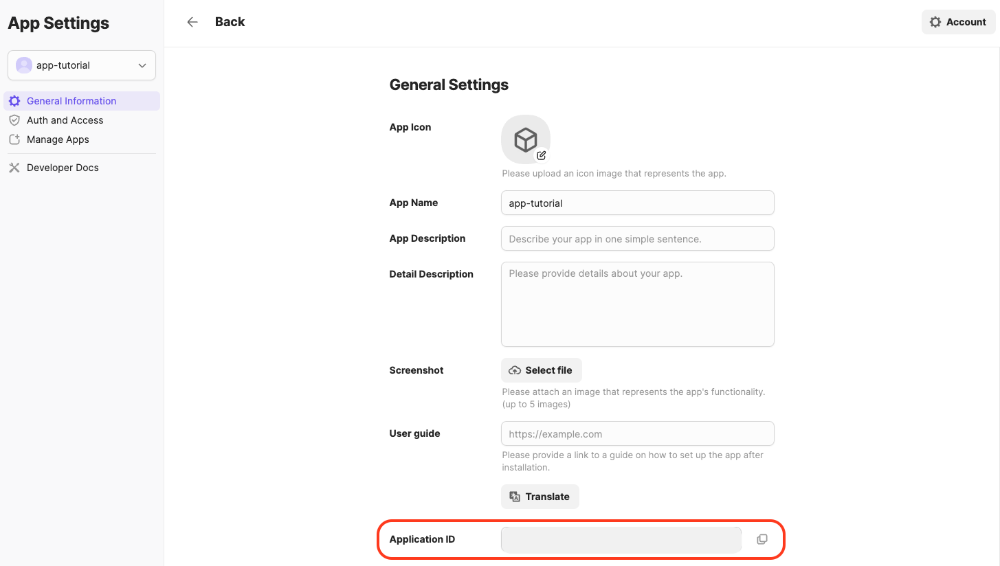
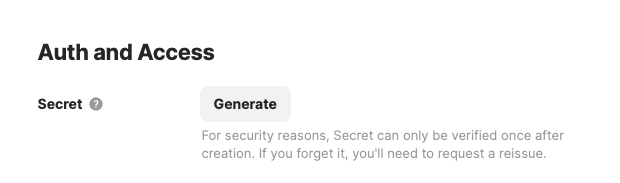
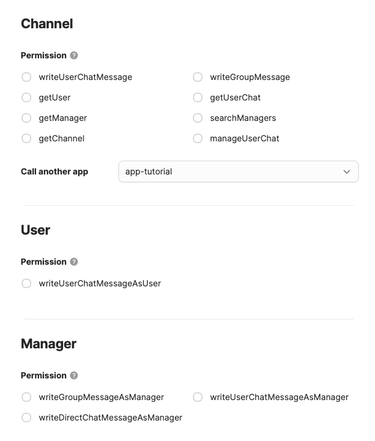
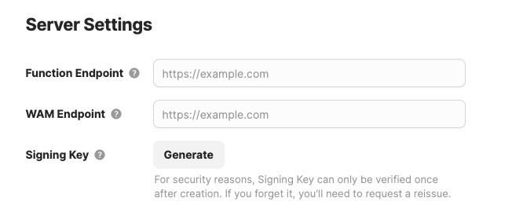
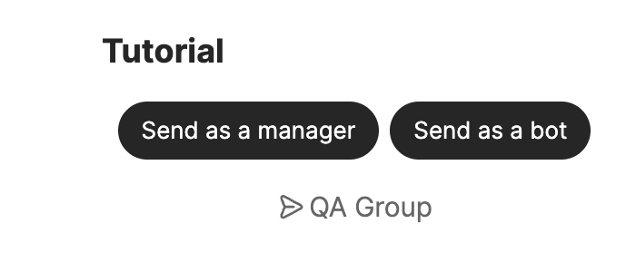
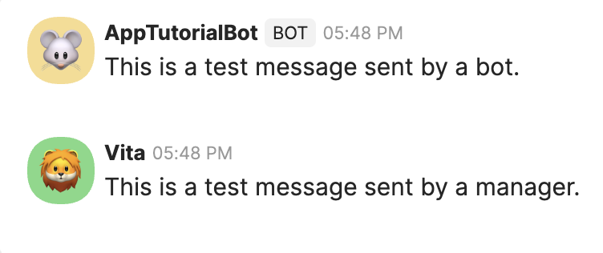

# 最初の Channel アプリを作る

このページだけで、開発用 private app の作成から `/tutorial` Command、React WAM、bot/manager
message の送信まで実行できます。Server language は TypeScript または Go のどちらかを選びます。
両方とも公式 SDK と公開 tutorial repository を使い、token 発行、Extension 登録、signature 検証、
WAM bridge を独自実装しません。

完了後は次を確認できます。

- SDK が `command` Extension と Function schema を自動登録する
- `/tutorial` で Channel client 内に WAM が開く
- WAM から app bot または現在の manager として test message を送信できる
- 不正な signature と不足 permission が明確に拒否される

## 1. 準備

共通で必要なもの:

- Channel developer portal にアクセスできる account
- Local server を公開する安定した HTTPS address または tunnel
- Git

TypeScript path には Node.js 20.11 以上と Corepack が必要です。Go path には Go 1.25 と、WAM
build 用の Node.js/Corepack が必要です。

Channel settings の App Store から app creation flow を開きます。画面配置は変わる場合が
ありますが、App Store、Create App、Auth and Access、Permissions、Server Settings の意味は
同じです。



開発用の名前を入力し、terms に同意して private app を作成します。



## 2. Credential と permission の設定

General settings で App ID を確認します。App ID は公開 identity ですが、App Secret と Signing
Key は server secret です。



Auth and Access で App Secret、Server Settings で Signing Key を発行します。再表示されない場合が
あるため secret manager に保存し、Git、document、WAM、log に入れないでください。



Tutorial が必要とする最小 permission だけを有効にします。

- Channel: `writeGroupMessage`
- Manager: `writeGroupMessageAsManager`



この app には 4 つの trust boundary があります。

- Incoming Function: Signing Key で `x-signature` を検証
- Server から AppStore: SDK `TokenManager` が app/channel token を管理
- WAM の manager operation: Channel host が現在の manager を authorize
- External provider: OAuth は `ctx.authToken`、API key と `client_credentials` は Config を使用

詳細は [基本概念](concepts.md) を参照してください。

## 3. Server language を選んで clone

どちらか一方だけを進めます。

### TypeScript

```bash
git clone https://github.com/channel-io/app-tutorial-ts.git
cd app-tutorial-ts
corepack enable
cp server/.env.example server/.env
```

`server/.env` に入力します。

```dotenv
APP_ID=your-app-id
APP_SECRET=your-app-secret
SIGNING_KEY=your-hex-signing-key
```

### Go

```bash
git clone https://github.com/channel-io/app-tutorial.git
cd app-tutorial
corepack enable
cp .env.example .env
```

`.env` に `APP_ID`、`APP_SECRET`、`SIGNING_KEY` を入力し、現在の shell に読み込みます。

```bash
set -a
. ./.env
set +a
```

Repository の lockfile と Go module が検証済み SDK version を固定します。初回実行時に任意の
version へ変えないでください。

## 4. HTTPS endpoint の準備

Server を起動する前に安定した HTTPS tunnel を用意します。

| Path       | Local port |
| ---------- | ---------- |
| TypeScript | `3000`     |
| Go         | `3022`     |

Public address が `https://YOUR_HOST` の場合、Server Settings に次の root を保存します。

| Setting           | Value                            |
| ----------------- | -------------------------------- |
| Function Endpoint | `https://YOUR_HOST/functions`    |
| WAM Endpoint      | `https://YOUR_HOST/resource/wam` |



Function Endpoint に `/v1`、WAM Endpoint に `/tutorial` を追加しないでください。SDK と AppStore
が system version と WAM name を追加します。Credential、permission、endpoint の変更後は
startup auto-registration が再実行されるよう server を再起動します。

## 5. Install・build・test

### TypeScript

```bash
corepack pnpm install --frozen-lockfile
corepack pnpm build
corepack pnpm test
corepack pnpm typecheck
```

### Go

```bash
make build
make test
```

すべて成功する必要があります。Install failure を無視したり、signature verification を無効に
したまま次へ進まないでください。

## 6. Server を実行

### TypeScript

```bash
corepack pnpm start
```

### Go

```bash
make run
```

Server log で listener start と Extension registration success を確認します。SDK は app token を
cache し、camelCase payload で `registerExtension(appId, extensionName, systemVersion)` を呼び、
`extension.core.function.getFunctions` discovery に応答します。

Tutorial が公開する path:

| Path              | TypeScript                                    | Go                                            |
| ----------------- | --------------------------------------------- | --------------------------------------------- |
| Function Endpoint | `https://YOUR_HOST/functions`                 | `https://YOUR_HOST/functions`                 |
| WAM Endpoint      | `https://YOUR_HOST/resource/wam`              | `https://YOUR_HOST/resource/wam`              |
| Local WAM         | `http://localhost:3000/resource/wam/tutorial` | `http://localhost:3022/resource/wam/tutorial` |
| Health check      | server listener                               | `http://localhost:3022/ping`                  |

## 7. Test Channel で実行

Private app を test Channel に install するか、既存 install を refresh します。Channel の group
conversation で `/tutorial` を実行してください。Command が表示されない場合は server log の
Extension registration と Function discovery を先に確認します。

WAM が開いたら app bot と manager の両方を実行します。



2 つの test message が届くことを確認します。



次の failure path も確認します。

- Group chat 以外では unsupported state が表示される
- Manager permission を削除すると manager action が明確に失敗する
- `x-signature` がない、または Signing Key が誤っている request は拒否される
- Request 実行中は duplicate submission が無効になる

## 8. 実行した構造を理解する

- **Extension**: `command:v1` が `/tutorial` metadata を公開
- **Function**: `tutorial.open` と `tutorial.sendAsBot` が typed server operation として実行
- **WAM**: React UI は `/resource/wam/tutorial` から提供
- **App Function call**: `useCallFunction` が AppStore 経由で app server を呼ぶ
- **Native Function call**: `useNativeFunction` が現在の manager authorization で動作
- **Token**: server-side `TokenManager` だけが app/channel token を管理

TypeScript/Go source の場所は各 tutorial README の project map を参照してください。

## 9. Troubleshooting

| Symptom                        | Check                                                                      |
| ------------------------------ | -------------------------------------------------------------------------- |
| Extension registration failure | App ID/Secret、app token、public AppStore URL、server restart              |
| `401` / signature failure      | hex Signing Key、raw body preservation、`x-signature` verification        |
| `/functions/v1` returns `404`  | Portal は `/functions` root か、同じ SDK handler へ接続しているか          |
| WAM が開かない                 | WAM Endpoint は `/resource/wam` root か、WAM build が成功したか            |
| Manager action failure         | `writeGroupMessageAsManager`、group surface、manager authorization         |
| Bot action failure             | `writeGroupMessage`、installed Channel、channel-token cache                |

`SKIP_SIGNATURE_VERIFICATION=true` は隔離した local debugging 以外で使わないでください。App
Secret、Signing Key、access/refresh token、provider credential を issue や log に貼らないでください。

## 次のドキュメントはこの順序で確認してください

1. [基本概念](concepts.md) で Function、Extension、WAM、authentication、token の境界を理解します。
2. [アプリ開発完全ガイド](app-development.md) で design、security、deployment、operation を確認します。
3. [Function 登録](functions.md) で standalone typed app Function を定義します。
4. [Extension 完全ガイド](extensions.md) で必要な capability を選択し、詳細 recipe に従います。
5. 言語別 API は [TypeScript architecture と reference](../../reference/typescript/ARCHITECTURE.md) または
   [Go reference](../../reference/go/README.md) で確認します。
6. 実装中は完全な [TypeScript tutorial](https://github.com/channel-io/app-tutorial-ts) または
   [Go tutorial](https://github.com/channel-io/app-tutorial) を参照します。
